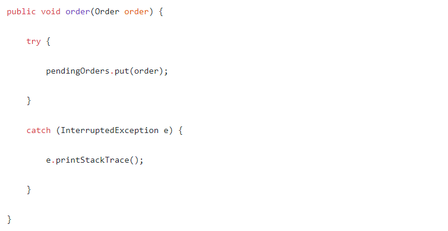

Pizza Hut 

1) при Interrupted exception может потеряться заказ. Когда складывается в blockingqueue. Как не потерять заказ?

2) Lock и LockInterr отличие. Структурно. Что будет при замене второго на первое.

LOCK
void lock()
Выставляет lock.
Если блокировка недоступна, текущий поток отключается для целей планирования потока и остается в неактивном состоянии до тех пор, пока блокировка не будет получена.

Особенности реализации

Реализация блокировки может быть в состоянии обнаружить ошибочное использование блокировки, например, вызов, который может вызвать взаимоблокировку, и может вызвать (непроверенное) исключение в таких обстоятельствах. Обстоятельства и тип исключения должны быть задокументированы этой реализацией Lock.

lockInterruptibly
void lockInterruptibly ()
                выдает InterruptedException
Получает блокировку, если текущий поток не прерывается.
Получает блокировку, если она доступна, и немедленно возвращается.

Если блокировка недоступна, текущий поток отключается для целей планирования потоков и остается в неактивном состоянии, пока не произойдет одно из двух:

Блокировка получена текущим потоком; или
Какой-то другой поток прерывает текущий поток, и поддерживается прерывание получения блокировки.
Если текущий поток:

имеет прерванный статус при входе в этот метод; или
прерывается во время получения блокировки, и поддерживается прерывание получения блокировки,
затем генерируется InterruptedException и очищается статус прерывания текущего потока.
Особенности реализации

Возможность прерывать получение блокировки в некоторых реализациях может быть невозможной, и, если возможно, может быть дорогостоящей операцией. Программист должен знать, что это может быть так. Реализация должна документировать, когда это так.

C:\Users\Yaroslav\Desktop\OOP-master\task_2_1_1>gradle run

> Task :compileJava
Note: C:\Users\Yaroslav\Desktop\OOP-master\task_2_1_1\src\main\java\ru\nsu\fit\oop\yaroslavodintsov\task_2_1_1\warehouse\QueueMy.java uses unchecked or unsafe operations.
Note: Recompile with -Xlint:unchecked for details.

> Task :run
bla
bla
bla
bla
bla

CTRL + X TO STOP

C:\Users\Yaroslav\Desktop\OOP-master\task_2_1_1>gradle build

Deprecated Gradle features were used in this build, making it incompatible with Gradle 7.0.
Use '--warning-mode all' to show the individual deprecation warnings.
See https://docs.gradle.org/6.5/userguide/command_line_interface.html#sec:command_line_warnings

BUILD SUCCESSFUL in 1s
6 actionable tasks: 3 executed, 3 up-to-date
